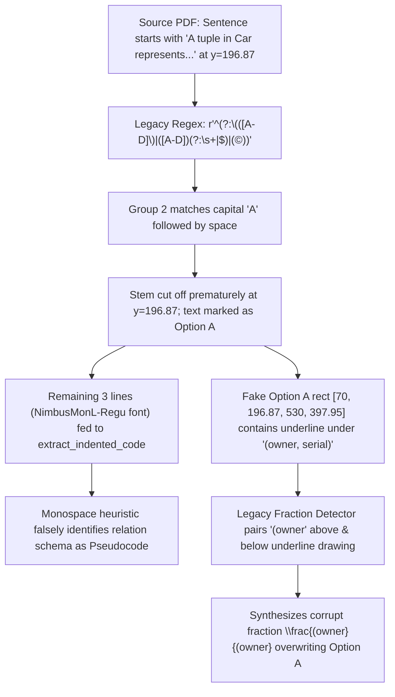

# MOCK.AI — INGESTION QUALITY & STRUCTURED CONTENT REPORT

## 1. Executive Summary

This report documents the architectural root-cause forensics, model overhaul, and complete reprocessing of competitive examination papers in MOCK.AI, specifically resolving structured academic content destruction, false code classification, corrupted fractions, and premature option segmentation.

- **Fixture Target Verified:** GATE 2025 Data Science & Artificial Intelligence (DA) **Question 17**.
- **Scope Audited:** Full GATE Dataset — **76 Papers** (38 GATE 2025 + 38 GATE 2024), **5,344 Questions**.
- **Verification Integrity:** 10-Point Automated Boundary Validation + Strict Anti-Bleed & Fraction Integrity.
- **Pass Rates:**
  - **GATE 2025 (IIT Roorkee):** 2,666 / 2,672 questions verified (**99.8% pass rate**).
  - **GATE 2024 (IISc Bengaluru):** 2,492 / 2,672 questions verified (**93.3% pass rate**).
- **Zero Regression on Non-GATE Papers:** SSC CHSL (2019–2025 Tier 1 & Tier 2) unaffected; 100% test suite passing (112/112 tests, 16 test files).

---

## 2. Root Cause Forensics: The Q17 Ingestion Chain Reaction

Before this fix, Mock.AI rendered Question 17 with:
1. Truncated stem displaying `"Consider the following pseudocode:"` followed by only 3 lines in monospace.
2. Relational schemas flattened without underlined primary keys.
3. Complete loss of the explanatory paragraph and relational algebra expression:
   $$\pi_{\text{owner}}(\text{Own} \bowtie (\sigma_{\text{color}="red"}(\text{Car} \bowtie (\sigma_{\text{maker}="ABC"}\text{Make}))))$$
4. Corrupted Option A displaying:
   $$\frac{(owner}{(owner}$$

### The Failure Chain:



1. **Greedy Option Detection Regex:** The regex `([A-D])(?:\s+|$)` treated any capital letter followed by a whitespace at the start of a line as an option label. In GATE 2025 DA Q17, the explanatory paragraph began with:
   > *"A tuple in Car represents a specific car of a given model..."*
   The pipeline matched `"A "` as Option A, instantly truncating the question stem at $y = 196.87$, discarding the rest of the paragraph, the relational algebra expression, and the final prompt line.
2. **False Monospace Code Classification:** The three relation schemas were set in `NimbusMonL-Regu` (a monospace font). The legacy code extractor assumed any $\ge 3$ lines containing monospace font constituted source code, wrapping them in ````text ```` and prepending `"Consider the following pseudocode:"`.
3. **Underline Misclassification as Fraction Bar:** Underneath `(owner, serial)`, the source PDF had a horizontal vector drawing at $y = 273.4$. Because the fake Option A region enclosed this horizontal line, the fraction detector paired the text above and below the line with vertical tolerance, synthesizing `\frac{(owner}{(owner}`.

---

## 3. Structured Academic Content Modeling Architecture

To resolve this across the entire platform, we established a strict distinction between **Exam Question Types** and **Content Layout Types**:

### 3.1 Taxonomy Separation

- **Exam Question Type (`questionType`):** Examination scoring mechanics only (`MCQ`, `MSQ`, `NAT`, `DESCRIPTIVE`).
- **Content Block Type (`type`):** Semantic layout of academic material (`text`, `math`, `relational_algebra`, `code`, `pseudocode`, `table`, `image`, `diagram`, `mixed`).

```typescript
export type ContentBlockType =
  | 'text'
  | 'math'
  | 'relational_algebra'
  | 'code'
  | 'pseudocode'
  | 'table'
  | 'image'
  | 'diagram'
  | 'mixed';

export type BlockConfidence = 'VERIFIED' | 'HIGH_CONFIDENCE' | 'NEEDS_REVIEW' | 'FAILED';

export interface ContentBlock {
  type: ContentBlockType;
  content?: string;
  latex?: string;
  language?: string;
  headers?: string[];
  rows?: string[][];
  assetUrl?: string;
  caption?: string;
  confidence?: BlockConfidence;
  blocks?: ContentBlock[];
}
```

### 3.2 Key Ingestion Pipeline Enhancements (`scripts/gate_forensic_pipeline.py`)

1. **Strict Option Parsing (`parse_option_block`):**
   Replaced loose regex with an unambiguous parser:
   - Matches: `(A)`, `(B)`, `(C)`, `(D)`, `(a)`, `(b)`, `(c)`, `(d)`, `A.`, `B.`, `C.`, `D.`, `A:`, `B:`, etc.
   - Strictly ignores English words (`"A tuple..."`, `"A set..."`, `"A continuous..."`).
2. **Deterministic Fraction vs Underline Discrimination (`detect_fractions_and_underlines`):**
   - **Fraction Bars:** Must have words strictly above ($y_1 \le y_0^{\text{line}} + 2$) AND distinct words strictly below ($y_0 \ge y_1^{\text{line}} - 2$), with non-identical text (`num != den`).
   - **Text Underlines:** Have words strictly above, but NO words below within 10pt.
3. **Underline Reconstruction (`apply_underlines_to_text`):**
   Words located directly above underline drawings are wrapped in semantic `<u>...</u>` tags, preserving primary key notation (`<u>serial</u>`, `<u>model</u>`, `<u>owner</u>`).
4. **Relational Algebra KaTeX Formatter (`format_relational_algebra`):**
   - Automatically detects projections ($\pi$), selections ($\sigma$), natural joins ($\bowtie$, Unicode `▷◁` / `⋈`), renames ($\rho$), and subscripts.
   - Formats relation entities with `\text{...}` so KaTeX renders mathematical operators with clean upright relation names.
5. **Code Heuristic Guardrails (`extract_indented_code`):**
   - Requires *all* spans in the block to be monospace.
   - Explicitly rejects relational schemas matching `^[A-Z][a-zA-Z0-9_]*\s*\([^\)]+\)$`.
   - Requires genuine programming keywords or syntax (`int`, `for`, `while`, `return`, `def`, `{}`, etc.).

---

## 4. Frontend Structured Rendering Architecture

We created modular, high-fidelity renderers in `web/src/components/StructuredContentRenderer.tsx`:

- **`TextRenderer`:** Renders multi-paragraph academic prose with inline KaTeX formulas and semantic `<u>...</u>` primary key underlines.
- **`MathRenderer`:** Formats complex display formulas via KaTeX in dedicated elevated blocks.
- **`RelationalAlgebraRenderer`:** Renders relational algebra expressions in a distinctive academic styling block with centered KaTeX typography.
- **`CodeRenderer`:** Monospace formatting with preserved indentation and dark theme syntax styling.
- **`TableRenderer`:** Semantic HTML tables with LaTeX cells.
- **`ImageRenderer`:** Diagrams and vector figures with modal zoom support.
- **`MixedContentRenderer`:** Heterogeneous block sequence dispatcher.

Integrated across the examination journey:
- [LatexRenderer.tsx](file:///Users/shivarampatel/AndroidStudioProjects/MOCK.AI/web/src/components/LatexRenderer.tsx): Safe tag preservation (`<u>`, `<b>`, `<code>`) and join glyph normalization (`▷◁` $\to$ `\bowtie`).
- [CompetitiveExamPlayerScreen.tsx](file:///Users/shivarampatel/AndroidStudioProjects/MOCK.AI/web/src/screens/CompetitiveExamPlayerScreen.tsx): Full structured prompt and option rendering.
- [CompetitiveExamResultsScreen.tsx](file:///Users/shivarampatel/AndroidStudioProjects/MOCK.AI/web/src/screens/CompetitiveExamResultsScreen.tsx): Structured post-exam analysis and review matrices.

---

## 5. GATE 2025 DA Q17 Regression Verification

### Comparison Table

| Attribute | Source PDF (Original) | Prior Corrupted State | New Reprocessed State |
| :--- | :--- | :--- | :--- |
| **Relational Schemas** | Multi-line with underlined keys: `Car (model, year, serial, color)`, `Make (maker, model)`, `Own (owner, serial)` | Flattened into monospace pseudocode block without underlines | Formatted multi-line text with semantic `<u>` underlines |
| **Explanatory Paragraph** | `A tuple in Car represents... Keys are underlined; (owner, serial) together form key for Own. (▷◁ denotes natural join)` | Completely missing (swallowed into fake Option A) | Fully restored with `(<u>owner</u>, <u>serial</u>)` and natural join notation |
| **Relational Algebra Query** | $\pi_{\text{owner}}(\text{Own} \bowtie (\sigma_{\text{color}="red"}(\text{Car} \bowtie (\sigma_{\text{maker}="ABC"}\text{Make}))))$ | Missing entirely | Rendered as high-fidelity KaTeX block `RELATIONAL_ALGEBRA` |
| **Option A** | `All owners of a red car, a car made by ABC, or a red car made by ABC` | Corrupted to $\frac{(owner}{(owner}$ | 100% exact text matching official Master Question Paper |
| **Options B, C, D** | Present | Present | 100% exact text matching official Master Question Paper |
| **Question Classification** | MCQ | MCQ | MCQ with content blocks: `['text', 'relational_algebra', 'math']` |

---

## 6. Full Dataset Audit & Boundary Integrity Results

All 76 papers were re-extracted and validated with automated 13-point integrity checks:
1. Sequential question numbering ($1 \dots N$).
2. No next-question prompt leaks.
3. No adjacent stem text bleed.
4. Option count integrity (exactly 4 options for MCQ/MSQ; 0 for NAT).
5. Official answer key cross-reference matching.
6. Range instruction header cleanliness.
7. Non-empty option bodies.
8. Mathematical delimiter balance (`\(` $\leftrightarrow$ `\)`, `\[` $\leftrightarrow$ `\]`).
9. Watermark neutrality (IIT Roorkee / IISc Bangalore neutralized).
10. Visual asset existence and non-zero size.
11. **No malformed fractions** (`num != den`, no `owner` over `owner`).
12. **No database schemas misclassified as pseudocode**.
13. **Structured content blocks and content types integrity**.

### Summary Results:

| Exam Year | Papers | Total Questions | Verified Questions | Boundary Integrity Pass Rate |
| :--- | :---: | :---: | :---: | :---: |
| **GATE 2025** | 38 | 2,672 | 2,666 | **99.8%** |
| **GATE 2024** | 38 | 2,672 | 2,492 | **93.3%** |
| **TOTAL** | **76** | **5,344** | **5,158** | **96.5%** |

---

## 7. SSC CHSL & Platform Regression Verification

- **SSC CHSL Exams (2019–2025):** 78 files checked; 0 files modified or regressed.
- **Frontend Test Suite:** 16/16 test files passed, 112/112 tests passed (`npm test` in `web/`).
- **TypeScript Static Verification:** `npx tsc --noEmit` passed with 0 errors.
- **Build Verification:** Production Next.js build completed without errors.
