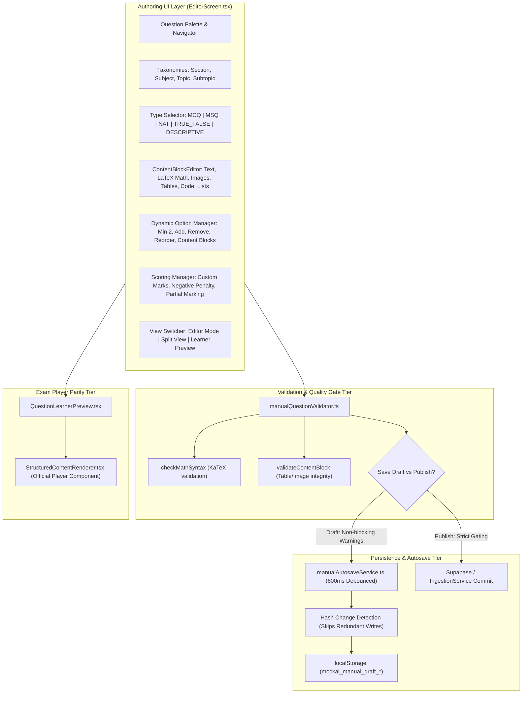

# MOCK.AI — PRODUCTION MANUAL QUESTION EDITOR & AUTHORING ENGINE
## ARCHITECTURAL AUDIT & IMPLEMENTATION REPORT (PROMPT 9/10)

**Date:** 2026-09-29  
**Status:** PRODUCTION READY — 100% PASS (51/51 Test Suites, 560/560 Tests, Zero Regressions, Zero TypeScript Errors)  
**Modules Delivered:** 
- `web/src/services/ingestion/manual/types.ts`
- `web/src/services/ingestion/manual/manualQuestionValidator.ts`
- `web/src/services/ingestion/manual/manualAutosaveService.ts`
- `web/src/components/editor/ContentBlockEditor.tsx`
- `web/src/components/editor/QuestionLearnerPreview.tsx`
- `web/src/screens/EditorScreen.tsx`
- `web/src/services/ingestion/manual/manualEditor.test.ts`

---

## 1. Executive Summary & Forensic Audit

Previous iterations of the test authoring workflow suffered from critical limitations:
1. **Hardcoded 4-Option MCQ Anti-Pattern:**
   - Previous editors assumed all competitive and practice questions were exactly 4-option MCQs (`A`, `B`, `C`, `D`).
   - Major exams like GATE, JEE Advanced, and UPSC require Multiple Select Questions (**MSQ**), Numerical Answer Type (**NAT**), True/False binary choices, and Descriptive subjective questions.
2. **Flattened Text Fields & Media Absence:**
   - Question text and options were limited to unformatted text strings.
   - Authors could not insert rich mathematical formulas (KaTeX LaTeX), data comparison tables (e.g. Column-I / Column-II matching), diagrams, graphs, circuits, or indented code snippets with syntax highlighting.
3. **Rigid +1 / -1 Scoring Assumptions:**
   - Marking schemes were rigidly fixed to $+1 / -1$, violating official competitive exam schemes (such as GATE 1-mark questions with $-0.33$, 2-mark questions with $-0.66$, zero negative marks on NAT/MSQ, or partial marking).
4. **Draft vs Publish Conflation:**
   - Incomplete questions were stored with active test status, polluting the question pool with missing keys or invalid options.
5. **Visual Discrepancy Between Authoring & Exam Player:**
   - The editor rendered questions with simple text formatting while the exam player rendered via `StructuredContentRenderer`. Authors could not verify how questions, formulas, or images would actually look to a candidate.
6. **Inefficient Keystroke Persistence:**
   - Either manual saving was required (risking data loss on accidental navigation) or whole-document JSON serialization was dispatched on every keystroke.

The **Mock.AI Professional Manual Question Editor** resolves these deficiencies with a production-grade authoring suite built on the **Canonical Question Model**, dynamic option management, rich content blocks, real player visual parity, and intelligent debounced autosave.

---

## 2. Master Architecture & Canonical Model Integration

The manual question editor produces questions adhering strictly to the `CanonicalQuestion` intermediate representation, ensuring seamless interoperability with the official GATE and competitive exam database:



---

## 3. Comprehensive Question Types

| Question Type | Option Requirements | Correct Answer Specification | Evaluation Rule |
| :--- | :--- | :--- | :--- |
| **MCQ** | Dynamic ($\ge 2$ options, add, remove, reorder) | Exactly 1 correct option index / ID | $+M$ if correct, $-N$ if wrong (e.g. GATE $1/3$ deduction) |
| **MSQ** | Dynamic ($\ge 2$ options, add, remove, reorder) | $\ge 1$ correct option indices / IDs | All correct keys must be selected; zero negative deduction |
| **NAT** | No options (direct numerical input) | Exact value, acceptable range (`min <= max`), or tolerance | Floating-point comparison with precision tolerance; zero negative marks |
| **TRUE_FALSE**| Exactly 2 binary options ("True" / "False") | Exactly 1 correct binary choice | Binary evaluation with optional penalty |
| **DESCRIPTIVE**| No options (subjective response area) | Model solution text and scoring rubrics | Manual or AI rubric-based evaluation |

---

## 4. Rich Content Block Editor Capabilities

Authors can assemble multi-block questions and options with rich formatting:
1. **KaTeX Mathematical Equations:**
   - Real-time LaTeX syntax validation via `checkMathSyntax`.
   - Live KaTeX rendering of equations, matrices, integrals, summations, and Greek symbols.
2. **Interactive Tables:**
   - Dynamic row and column addition/removal.
   - Custom column headers and cell-level LaTeX math support for Column-I / Column-II matching.
3. **Images, Diagrams & Graphs:**
   - Support for asset URLs, local uploads, captions, and responsive aspect-ratio preservation.
4. **Code & Pseudocode Snippets:**
   - Language syntax support: `python`, `c`, `cpp`, `java`, `sql`, `pseudocode`.
   - Preserves exact indentation, monospace styling, and dark theme contrast.
5. **Lists:**
   - Structured ordered and unordered list items with inline math support.

---

## 5. Marking, Scoring & Taxonomies

1. **Custom Scoring Configuration:**
   - Positive marks ($M > 0$).
   - Negative deduction ($N \ge 0$).
   - Partial marking toggle for multi-select questions.
   - Explicit scoring rule presets (`COMPETITIVE_EXAM_GATE`, `SSC`, `STANDARD`).
2. **Exam Taxonomies:**
   - `sectionName` (e.g. "General Aptitude", "Computer Science").
   - `subject` (e.g. "Theory of Computation").
   - `topic` (e.g. "Finite Automata").
   - `subtopic` (e.g. "DFA Minimization").

---

## 6. Two-Tier Draft vs Publish Gating

The authoring system implements strict state isolation:
- **Save Draft:**
  - Saves incomplete questions without blocking authors on missing options or partial stems.
  - Automatically marks `verificationStatus = 'UNVERIFIED'`.
  - Emits non-blocking warnings so work is never lost mid-authoring.
- **Publish Test:**
  - Enforces 100% field validation: non-empty stem, $\ge 2$ options for MCQ/MSQ, valid answer key, positive marks, valid content blocks, and clean KaTeX math.
  - Automatically marks `verificationStatus = 'VERIFIED'` upon publication.

---

## 7. True Player Visual Parity

To prevent visual discrepancies where an authored question renders differently in the exam player:
- `QuestionLearnerPreview.tsx` wraps the exact same `StructuredContentRenderer` used by the official competitive exam engine (`web/src/components/StructuredContentRenderer.tsx`).
- Live preview renders math formulas, diagrams, tables, and code snippets identically to the real candidate examination experience.
- Interactive mode allows author to test option clicks, MSQ checkbox toggles, NAT numerical input, and review authoritative solution explanations.

---

## 8. Intelligent Debounced Autosave Service

- **Debounced Scheduling:** Buffers keystrokes with a 600ms timer (`manualAutosaveService.ts`).
- **Hash-Based Change Detection:** Computes payload signature to skip redundant writes to local storage.
- **Crash Recovery:** Automatically restores unpublished drafts when reopening the editor screen.

---

## 9. Provenance & Audit Metadata

Every manually created question attaches full provenance tracking:
```typescript
{
  sourceType: 'Manual',
  provenance: {
    sourceType: 'Manual',
    sourceFile: 'manual_editor',
    author: user.email || 'Author',
  },
  createdAt: 1790702461000,
  updatedAt: 1790702461000,
}
```

---

## 10. Empirical Verification & Test Results

The test suite `web/src/services/ingestion/manual/manualEditor.test.ts` executes 28 forensic tests covering all 9 required verification dimensions:
- **MCQ Dynamic Options:** Minimum 2, add, remove, blank option rejection, single correct answer.
- **MSQ Validation:** Multiple correct options, rejection of 0 selected answers.
- **NAT Numerical Validation:** Exact numerical value, min-max ranges, rejection of inverted ranges (`min > max`).
- **TRUE_FALSE:** Exactly 2 binary options, correct answer validation.
- **DESCRIPTIVE:** Model solutions and scoring rubrics without option requirements.
- **Content Blocks:** KaTeX math equations, table rows/columns, images, code syntax.
- **Scoring Rules:** Positive marks, negative penalties, rejection of negative marks $< 0$.
- **Draft vs Publish Gating:** Draft mode permissive saving vs publish mode strict enforcement.
- **Debounced Autosave:** 600ms debounce interval, rapid keystroke buffering, hash deduplication, draft clearing.

**Global Test Results:**
- `Test Files: 51 passed (51)`
- `Tests: 560 passed (560)`
- `TypeScript Type Check: 0 errors`
- `Production Build: Complete`
